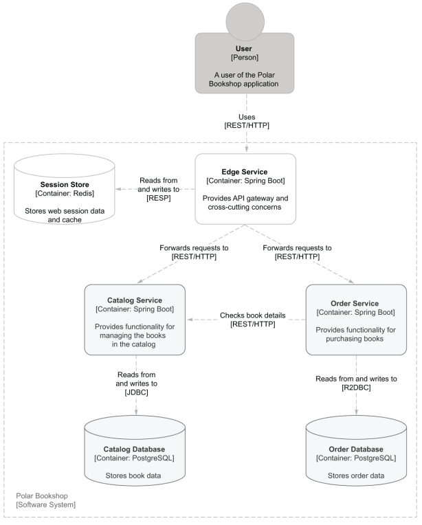

# Polar Bookshop


---
## Set Up Instructions
### 1. Install required software
* Install [Docker](https://www.docker.com/) 
* Install [Docker Compose](https://docs.docker.com/compose/install/)
* Install [Minikube](https://minikube.sigs.k8s.io/docs/start/) 
* Install [Kubectl](https://kubernetes.io/docs/tasks/tools/)
* Install [Tilt](https://docs.tilt.dev/index.html)

### 3. Clone this Repository
Clone this repository and run the following commands in the root directory
of the repository

### 2. Run with Docker Compose
```bash
docker compose up
```

### 3. Develop with Tilt in Minikube

```bash
chmod +x ./create-k8s-cluster
./create-k8s-cluster
tilt up
```